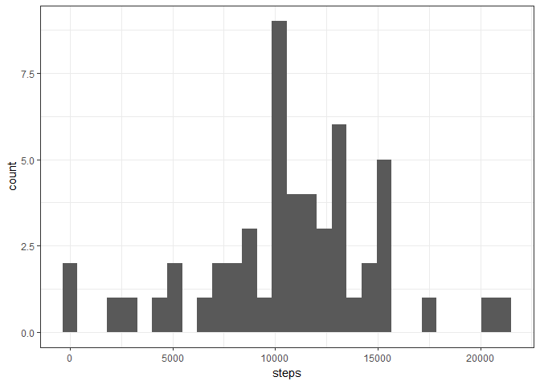
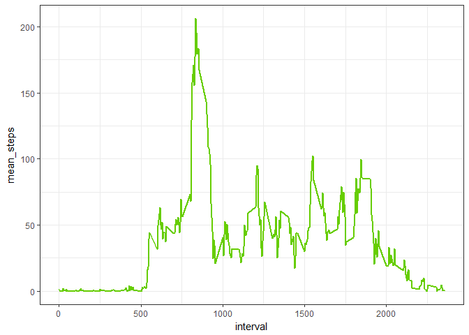
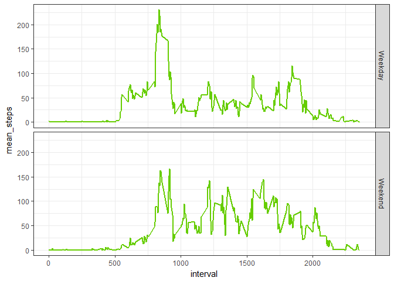

#### Set "path" to working directory and load all required libraries

    # Set path
    path <- "D:/Dropbox/Promotion/Courses/2017_08_Coursera_Reporducible_Research/week_2/"

    # Load required libraries
    library(ggplot2)

Note: "This"path" should include the folder should also contain the data
folder that holds the data that you want to read in.

#### Read in the data file and process/transform the data if necessary

    # Read in data
    activity_raw <- read.csv(paste(path, "data/activity.csv", sep = ""))

    # Transform data
    ##str(activity)
    activity_raw$date <- as.Date(activity_raw$date, "%Y-%m-%d")
    activity_raw$steps <- as.numeric(activity_raw$steps)
    ##summary(activity)
    ##head(activity)
    activity <- na.omit(activity_raw)

Note: I optionally added some commands to analyze how the data looks
like. To run these scripts, remove the "\#\#" in front of the line.

#### Next, process the data to answer the questions

**What is mean total number of steps taken per day?**

Q1. Calculate the total number of steps taken per day

    steps_per_day <- as.data.frame(aggregate(steps ~ date, activity, sum))
    ##steps_per_day

Q2. If you do not understand the difference between a histogram and a
barplot, research the difference between them. Make a histogram of the
total number of steps taken each day

    qplot(steps, data = steps_per_day) + theme_bw()

    ## `stat_bin()` using `bins = 30`. Pick better value with `binwidth`.

Q3. Calculate and report the mean and median of the total number of
steps taken per day

    mean(steps_per_day$steps)

    ## [1] 10766.19

    median(steps_per_day$steps)

    ## [1] 10765

**What us the average daily activity pattern?**

Q1. Make a time series plot (i.e. type = "l") of the 5-minute interval
(x-axis) and the average number of steps taken, averaged across all days
(y-axis)

    activ_interval <- as.data.frame(aggregate(steps ~ interval, activity, mean))
    names(activ_interval)[2] <- "mean_steps"
    ##activ_interval

    ggplot(activ_interval, aes(interval, mean_steps)) + geom_line(size = 1, color = "chartreuse 3") + theme_bw()

Q2. Which 5-minute interval, on average across all days in the dataset,
contains the maximum number of steps?

    activ_interval[activ_interval$mean_steps==max(activ_interval$mean_steps),]

    ##     interval mean_steps
    ## 104      835   206.1698

**Imputing missing values**

Note that there are a number of days/inntervals where there are missing
values. The presence of missing values may introduce bias into some
calculations or summaries of the data.

Q1. Calculate and report the number of missing values in the dataset
(i.e. the total number of rows with NAs)

    summary(is.na(activity_raw))

    ##    steps            date          interval      
    ##  Mode :logical   Mode :logical   Mode :logical  
    ##  FALSE:15264     FALSE:17568     FALSE:17568    
    ##  TRUE :2304

Q2. Devise a strategy for filling in all of the missing values in the
dataset. The strategy does not need to be sophisticated. For example,
you could use the mean/median for that day, or the mean for that
5-minute interval, etc.

    activ_imputed <- merge(activity_raw, activ_interval)

Q3. Create a new dataset that is equal to the original dataset but with
the missing data filled in.

    activ_imputed$steps[is.na(activ_imputed$steps)] <- activ_imputed$mean_steps[is.na(activ_imputed$steps)]
    summary(is.na(activ_imputed)) # Now no NAs in column "steps" anymore

    ##   interval         steps            date         mean_steps     
    ##  Mode :logical   Mode :logical   Mode :logical   Mode :logical  
    ##  FALSE:17568     FALSE:17568     FALSE:17568     FALSE:17568

Q4. Make a histogram of the total number of steps taken each day and
Calculate and report the mean and median total number of steps taken per
day. Do these values differ from the estimates from the first part of
the assignment? What is the impact of imputing missing data on the
estimates of the total daily number of steps?

    activ_imputed_day <- as.data.frame(aggregate(steps ~ date, activ_imputed, sum))
    qplot(steps, data = activ_imputed_day)

    ## `stat_bin()` using `bins = 30`. Pick better value with `binwidth`.

    mean(activ_imputed_day$steps)

    ## [1] 10766.19

    median(activ_imputed_day$steps)

    ## [1] 10766.19

**Are there differences in activity patterns between weekdays and
weekends?**

For this part the weekdays() function may be of some help here. Use the
dataset with the filled-in missing values for this part.

Q1. Create a new factor variable in the dataset with two levels -
"weekday" and "weekend" indicating whether a given date is a weekday or
weekend day.

    Sys.setlocale("LC_TIME", "English")

    ## [1] "English_United States.1252"

    activ_imputed$DayOfWeek <- weekdays(activ_imputed$date)
    activ_imputed$PartOfWeek <- as.factor(activ_imputed$DayOfWeek == "Saturday" | activ_imputed$DayOfWeek == "Sunday")
    levels(activ_imputed$PartOfWeek) <- c("weekday", "weekend")

Q2. Make a panel plot containing a time series plot (i.e. type = "l") of
the 5-minute interval (x-axis) and the average number of steps taken,
averaged across all weekday days or weekend days (y-axis). See the
README file in the GitHub repository to see an example of what this plot
should look like using simulated data.

    activ_weekday <- subset(activ_imputed, PartOfWeek == "weekday")
    activ_weekend <- subset(activ_imputed, PartOfWeek == "weekend")

    activ_interv_weekday <- as.data.frame(aggregate(steps ~ interval, activ_weekday, mean))
    activ_interv_weekday$PartOfWeek <- "Weekday"
    names(activ_interv_weekday)[2] <- "mean_steps"
    activ_interv_weekend <- as.data.frame(aggregate(steps ~ interval, activ_weekend, mean))
    activ_interv_weekend$PartOfWeek <- "Weekend"
    names(activ_interv_weekend)[2] <- "mean_steps"

    activ_interv_sum <- rbind(activ_interv_weekday, activ_interv_weekend)
    activ_interv_sum$PartOfWeek <-as.factor(activ_interv_sum$PartOfWeek)
    ggplot(activ_interv_sum, aes(interval, mean_steps)) + geom_line(size = 1, color = "chartreuse 3") + facet_grid(PartOfWeek ~ .) + theme_bw()

